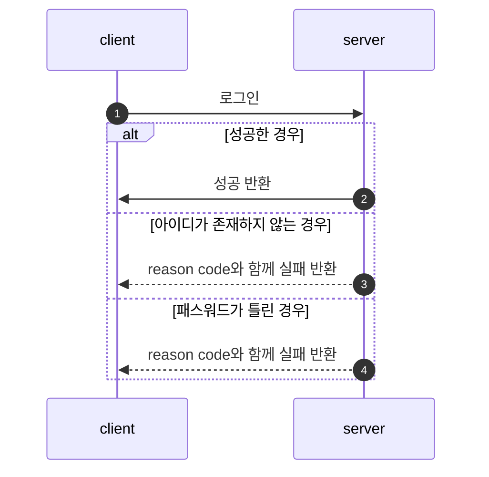
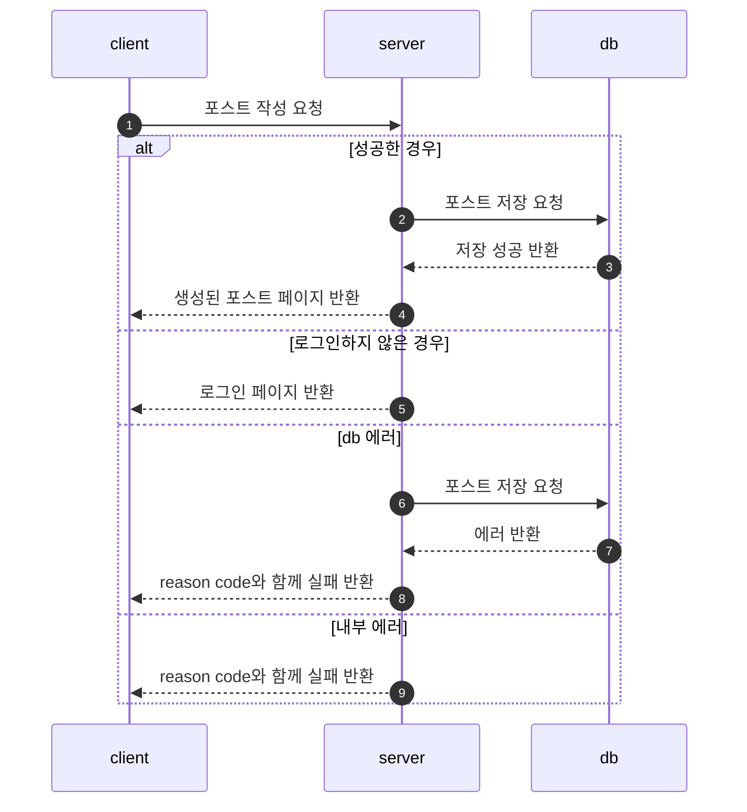
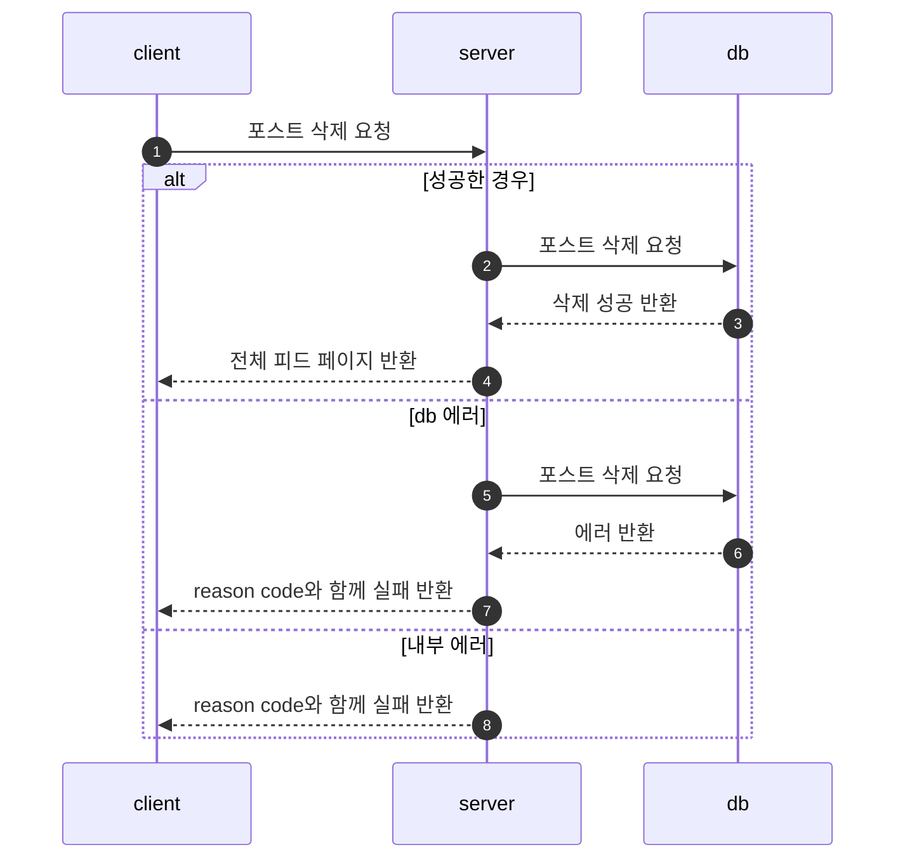
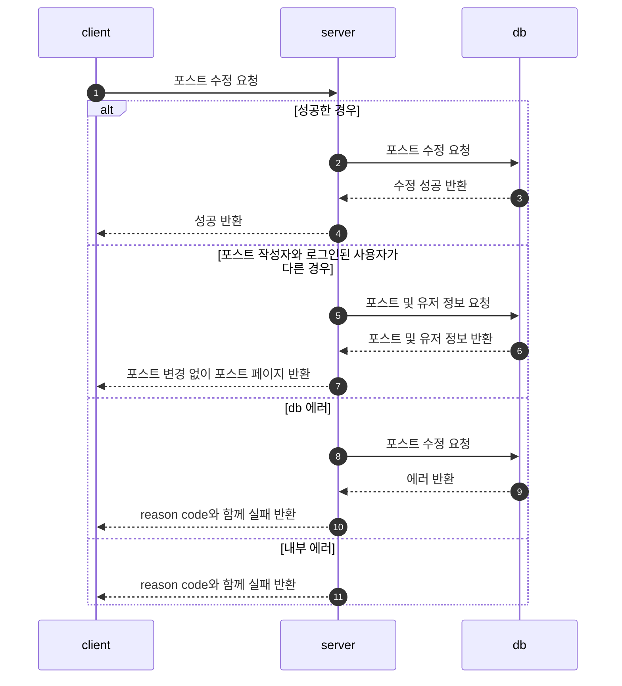
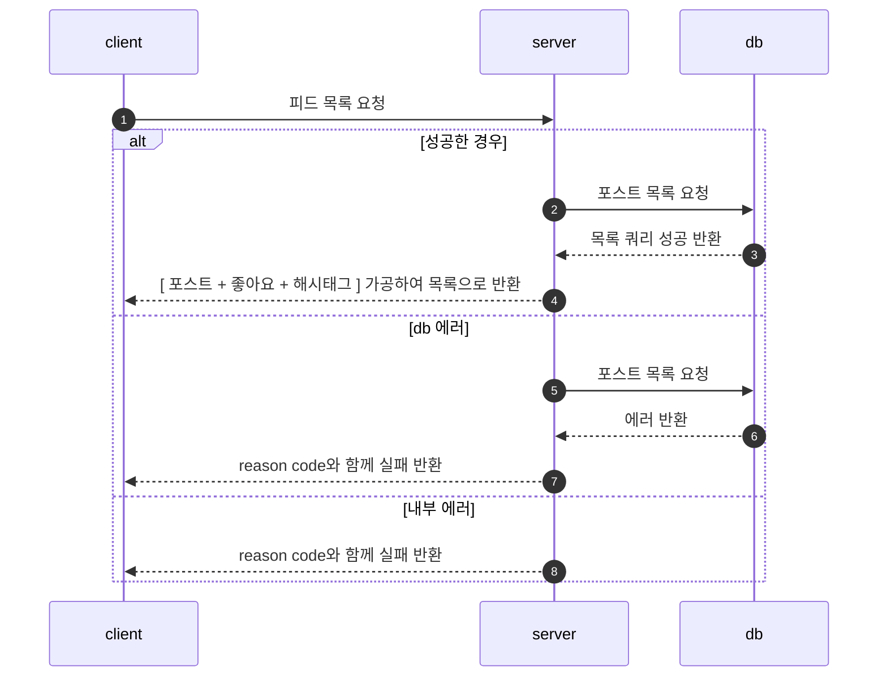
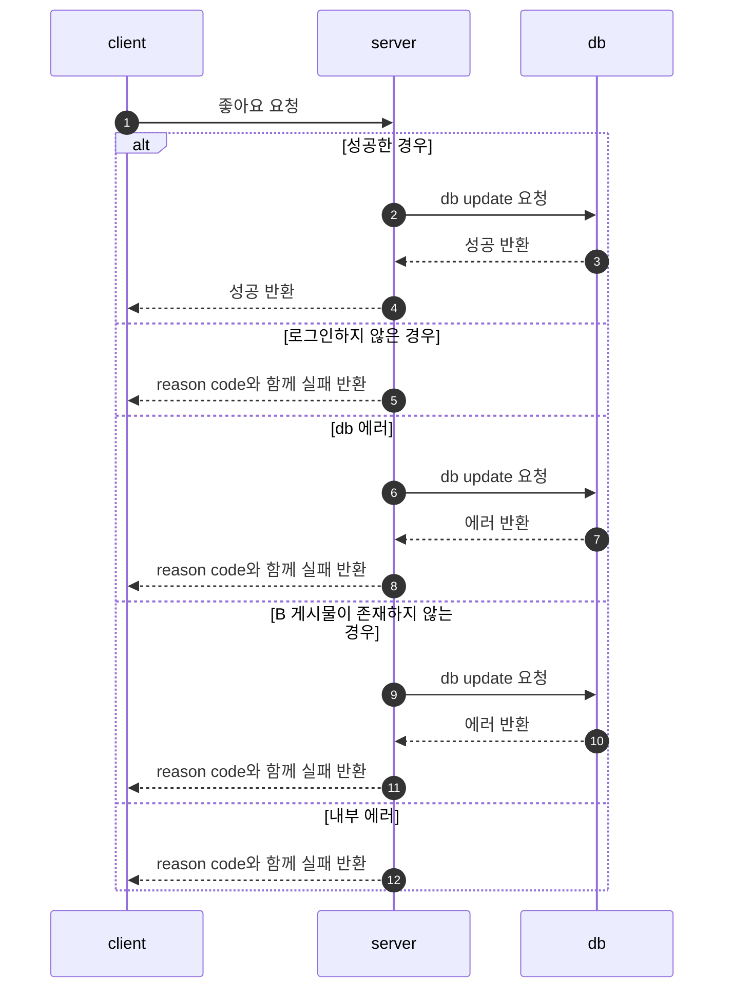
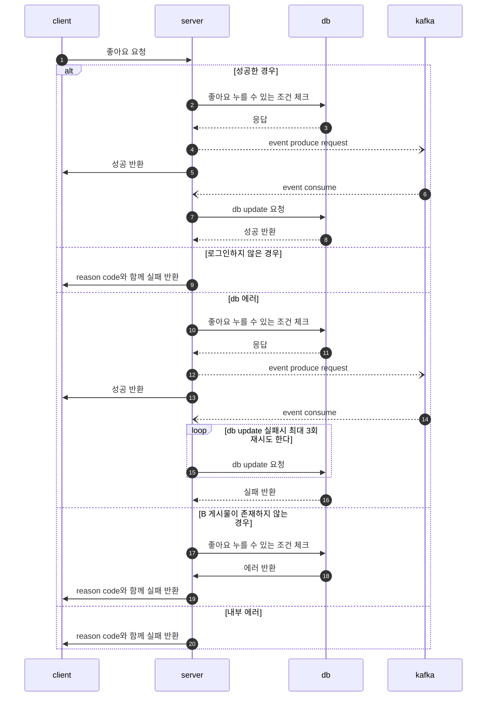
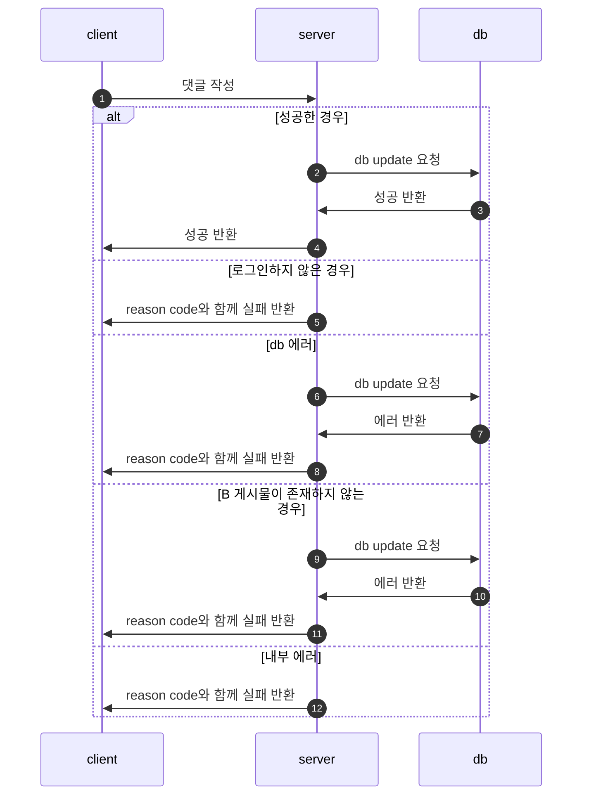
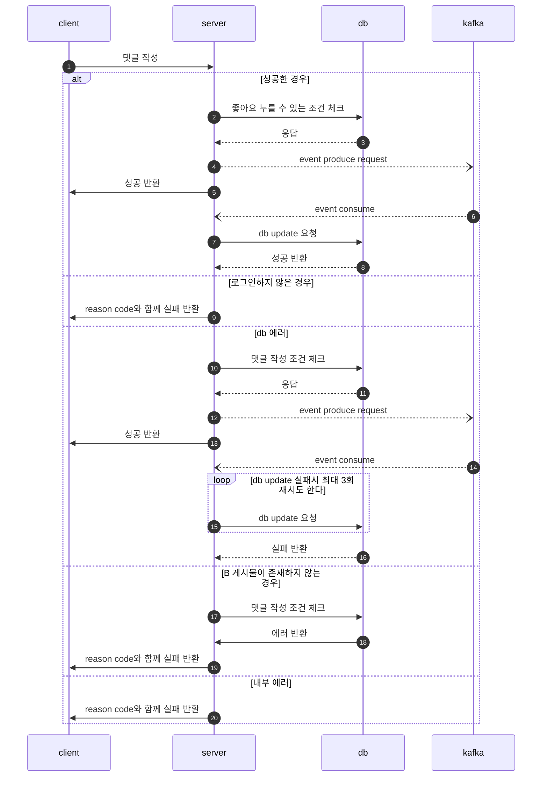
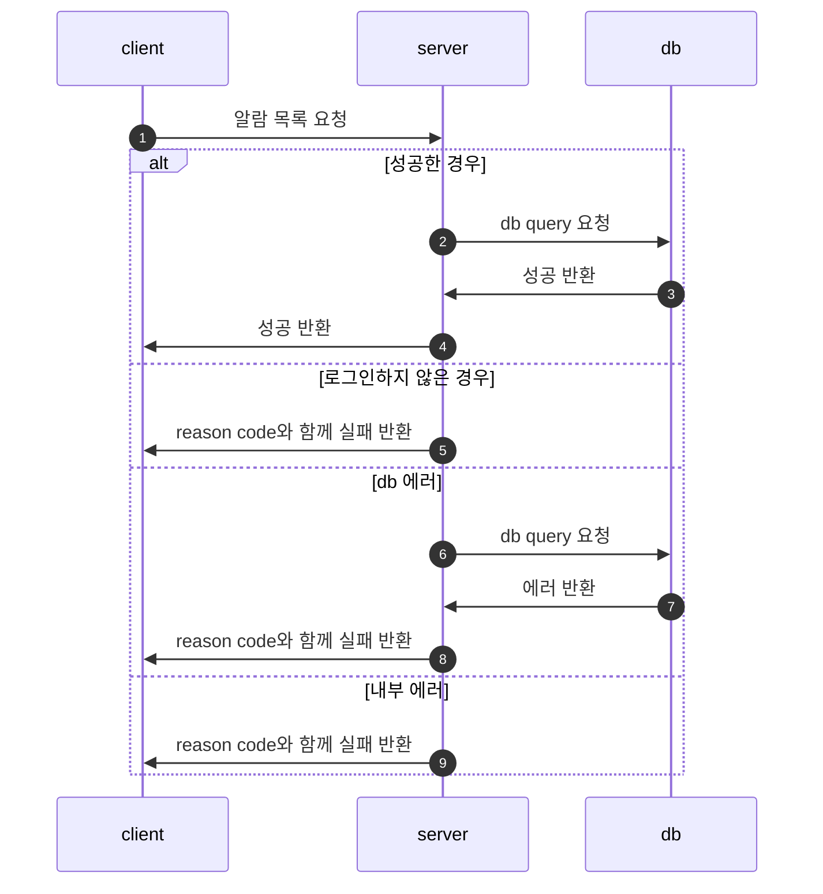

# SNS

## Application Architecture

## Flow Chart

1. 로그인

2. 포스트 작성

3. 포스트 삭제

4. 포스트 수정

5. 피드 목록 + 페이징

6. 좋아요 기능 : User A가 B 게시물에 좋아요를 누른 상황

7. 댓글 기능 : User A가 B 게시물에 댓글을 남긴 상황

8. 알람 기능 : User A의 알람 목록에 대한 요청을 한 상황

